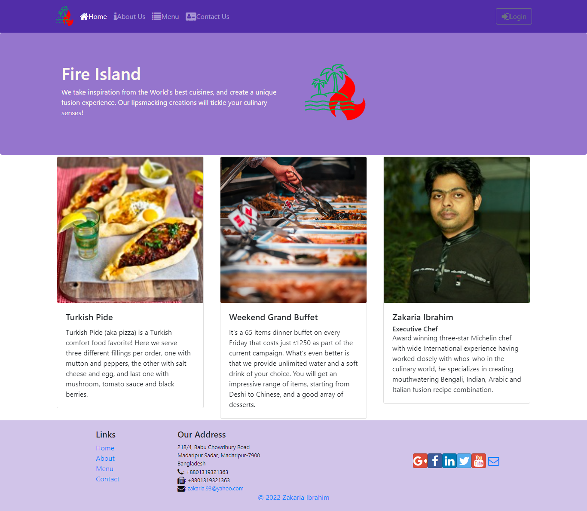
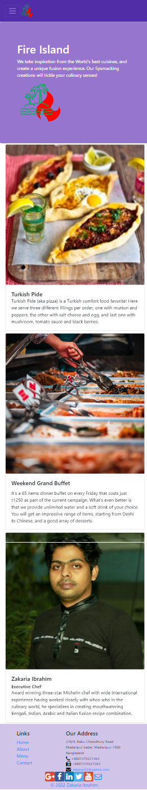
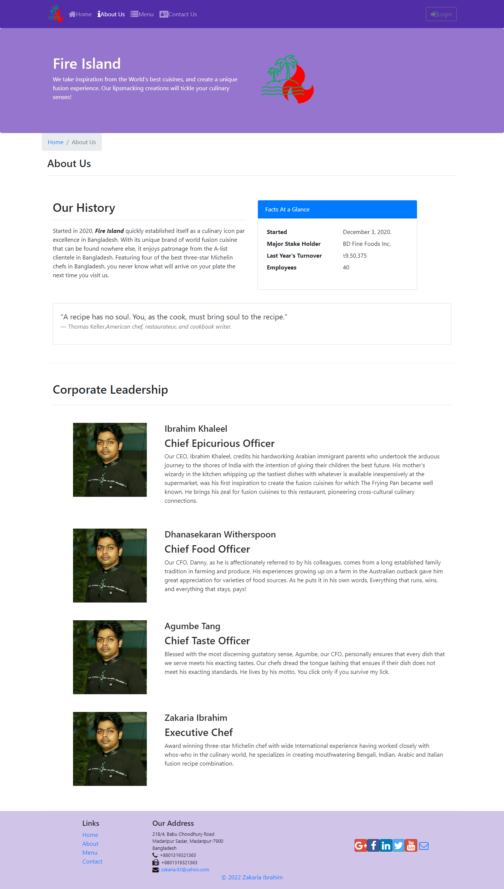
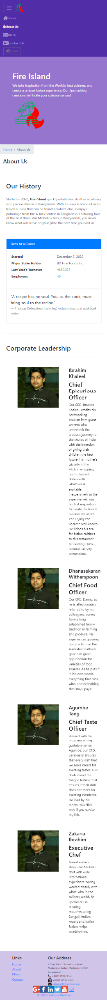
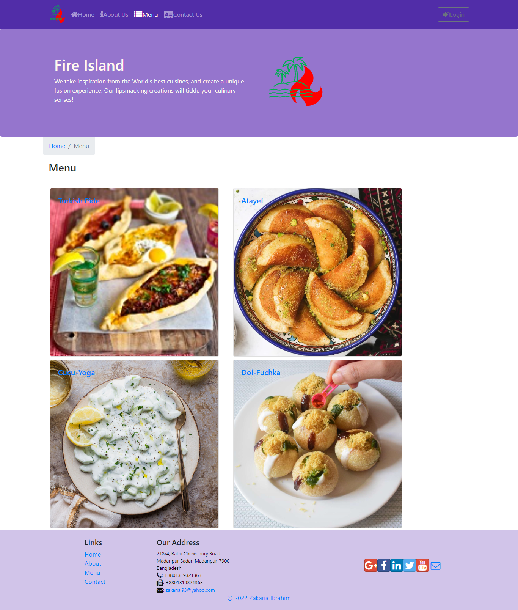
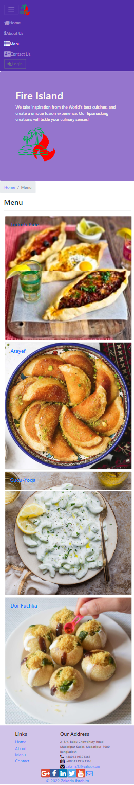
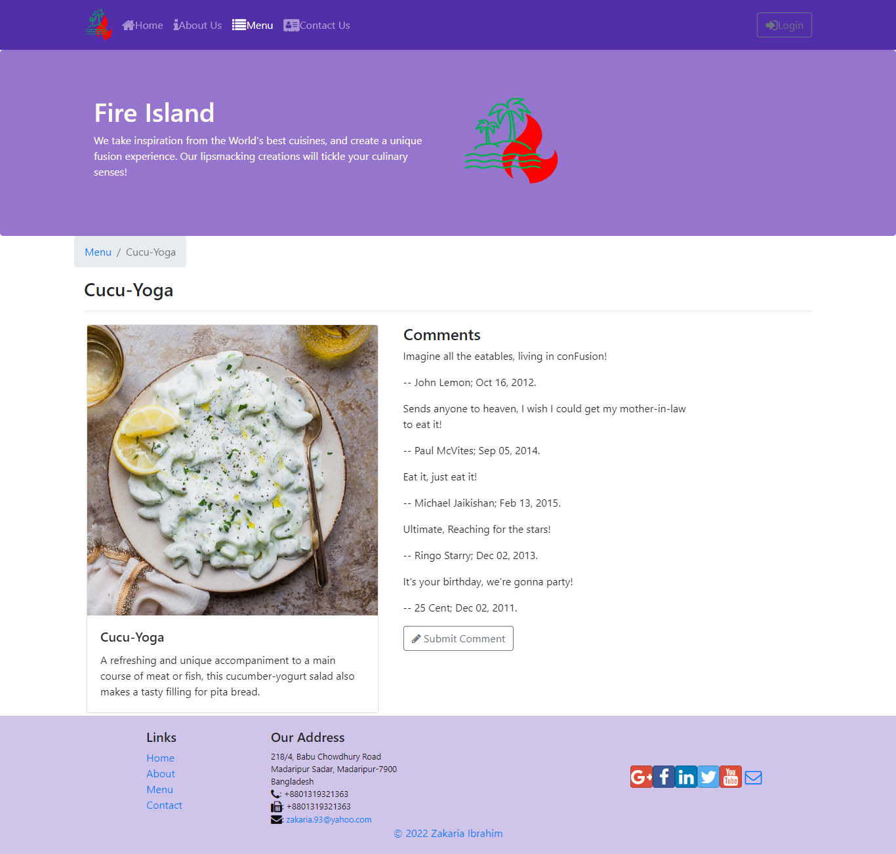
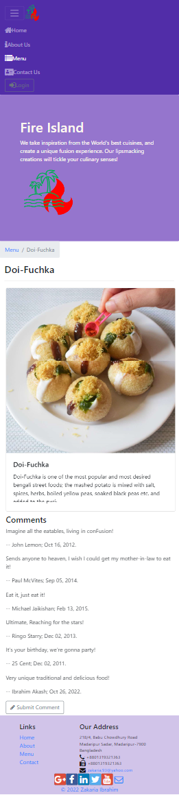
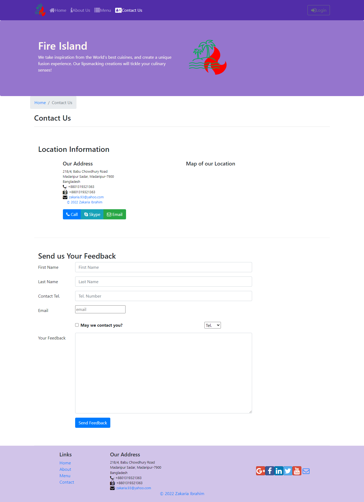
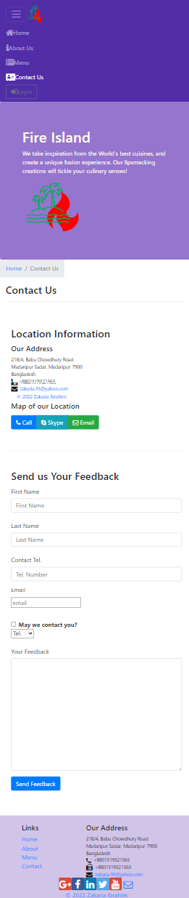

<ins>**Fire Island: A complete react web application for a restaurant**</ins>
 
A full stack web application development in the React ecosystem for a restaurant mainly based on React, React-redux, Bootstrap and Google Firebase.
  
Live URL: <ins>**[fire-island-bd.netlify.app](https://fire-island-bd.netlify.app/)**</ins>
  
<ins>**Some screenshots for desktop and mobile views:**</ins>
 
#Home page - desktop view:
  

  
#Home page - mobile view:
  

  
#About-us page - desktop view:
  

  
#About-us page - mobile view:
  

  
#Menu page - desktop view:
  

  
#Menu page - mobile view:
  

  
#Dish detail page - desktop view:
  

  
#Dish detail page - mobile view:
  

  
#Contact-us page - desktop view:
  

  
#Contact-us page - mobile view:
  

  